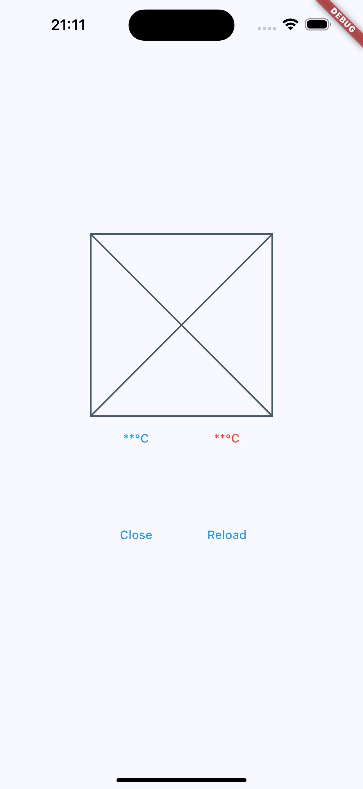
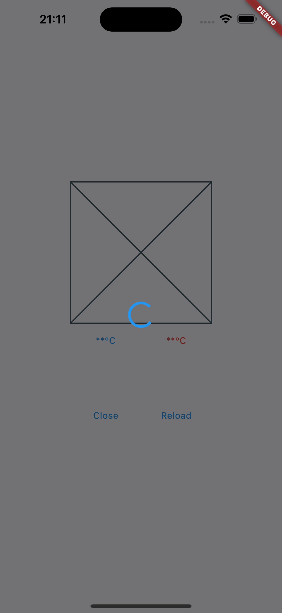
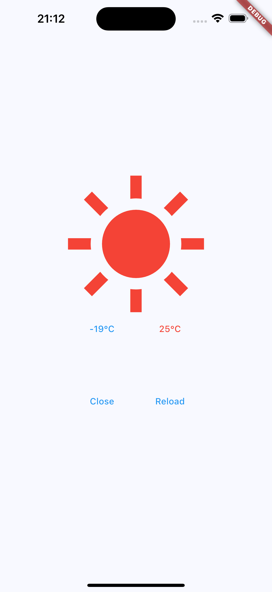
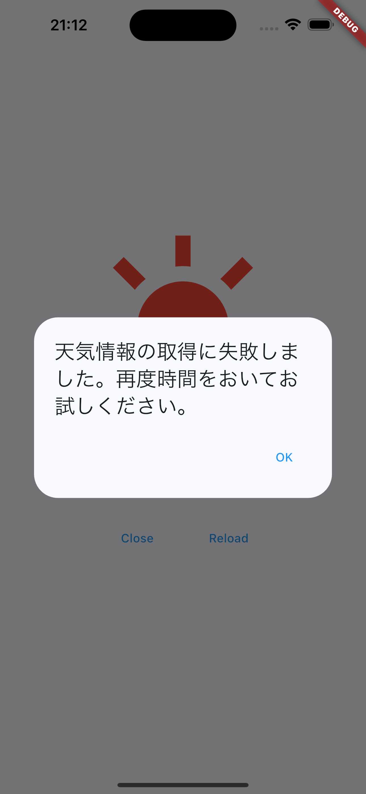
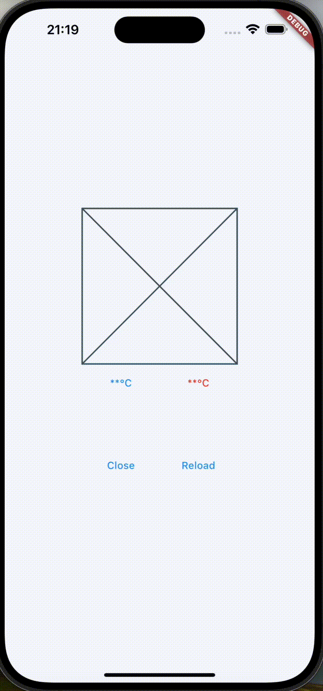

# [株式会社ゆめみ Flutter研修](https://github.com/yumemi-inc/flutter-training-template)

## 概要
[YumemiWeather API](https://yumemi-inc.github.io/flutter-training-template/)を利用して天気情報を表示するアプリです。株式会社ゆめみのFlutterエンジニアコードチェック課題の要件を満たすように実装しています。
本アプリを通して自分なりの最適なアーキテクチャを確立することを目的としています。

## 天気予報アプリ
| ケース1 | ケース2 |
|:---:|:---:|
|  |  |

| ケース3 | ケース4 |
|:---:|:---:|
|  |  |

