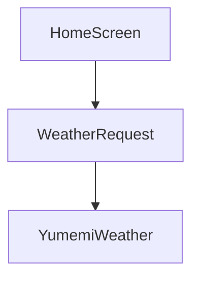
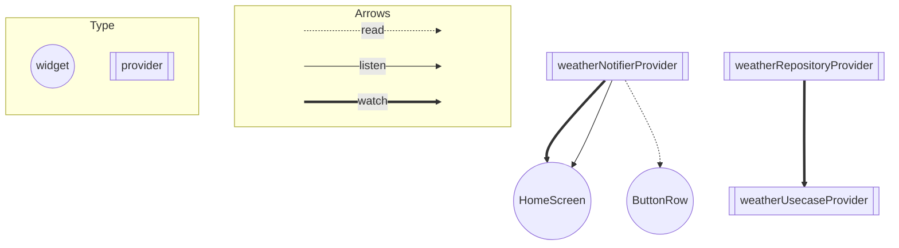

# 天気予報の状態管理とアーキテクチャ

## Riverpod導入前

- HomeScreenはweatherRequestに依存しており、WeatherRequestはYumemiWeatherに依存している。
- HomeScreenはWeatherRepositoryのgetWeatherからWeatherConditionResponseを受け取り、setStateを使用して画面の再描画をおこなう。

## Riverpod導入後

### UI
- HomeScreen
  - weatherNotifierProviderをreadして、getWeatherを実行
  - weatherNotifierProviderをwatchして、データの取得に成功すると返されたweatherDataを基に画面を更新
  - weatherNotifierProviderをlistenして、error時にエラーダイアログを表示
- ButtonRow
  - weatherNotifierProviderをreadしてgetWeatherを実行

### Data
#### Repository
- YumemiWeatherAPIからデータを取得する
- jsonデータをWeatherResponseに変換してusecaseに返す
- YumemiWeatherErrorを検出したらCustomWeatherErrorでラップしてthrowする
#### Usecase
- repositoryからデータを取得する
  - WeatherResponseの場合、Result.successでラップして返す
  - CustomWeatherErrorの場合、Result.failureでラップする
#### Provider
- usecaseからデータを取得する
- 取得したデータによってProviderを更新
